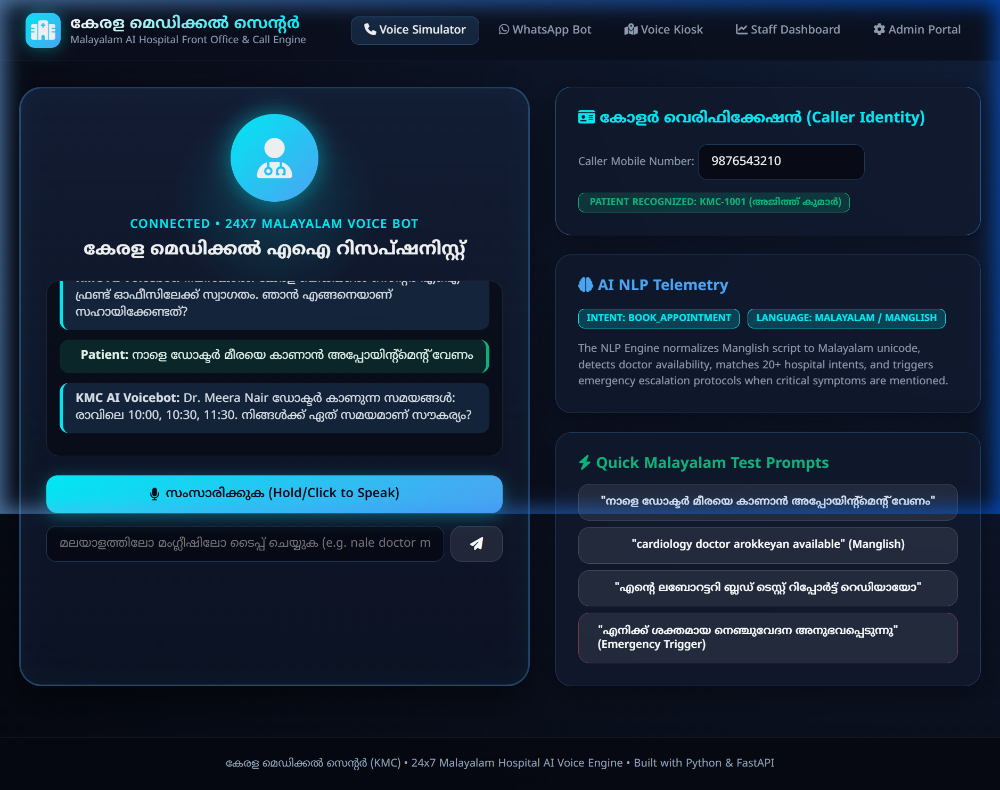
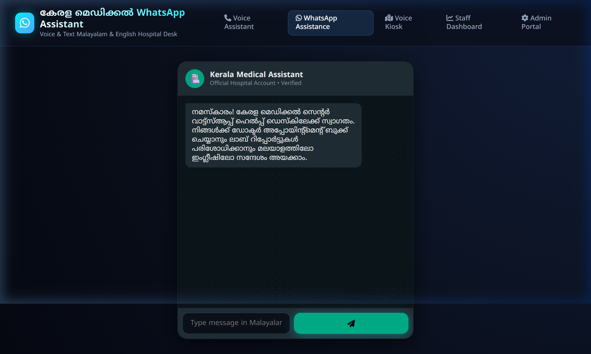
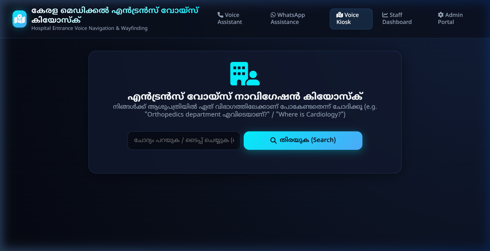
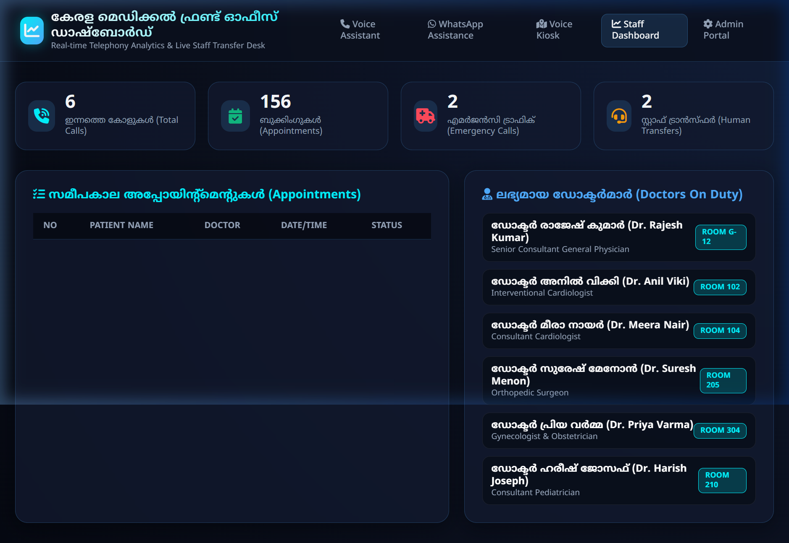
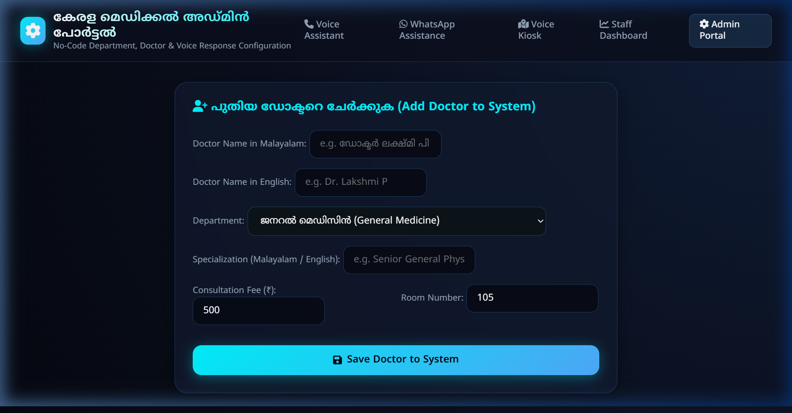

# 🏥 Kerala Medical Center - Multilingual Hospital Voice Assistant & Telephony System

[](https://www.python.org/)
[](https://fastapi.tiangolo.com/)
[](https://websockets.readthedocs.io/)
[](https://www.sqlalchemy.org/)
[]()

An advanced, production-grade **Multilingual (Malayalam + English + Manglish) Real-Time Voice Assistant & Telephony System** for hospitals and healthcare centers. Built with **Python, FastAPI, WebSockets, SQLite/SQLAlchemy**, Speech-to-Text streaming, Edge-TTS audio synthesis, Function/Tool calling, Voice Activity Detection (VAD), and Instant Barge-In interruption.

---

## 📸 Interface & Feature Screenshots

### 1. 🎙️ Main Voice Assistant & Real-Time Telephony Simulator
Features WebSockets bidirectional streaming, audio VAD volume meter, live STT stream rendering, instant **Barge-In interruption**, tool call badges, and real-time latency breakdown.



---

### 2. 📱 WhatsApp Assistant Integration
Simulates WhatsApp voice and text assistance for patients looking to check lab reports, request appointment slots, or query billing info in Malayalam or English.



---

### 3. 🗺️ Entrance Voice Navigation Kiosk
Entrance kiosk providing voice directions and floor mapping for patients looking for OPD rooms, labs, pharmacy, or emergency trauma care.



---

### 4. 📊 Staff & Receptionist Dashboard
Real-time dashboard monitoring incoming calls, appointment desks, on-duty doctors across departments, and human agent call transfers.



---

### 5. ⚙️ Admin Configuration Portal
No-code administration portal allowing hospital administrators to register new doctors, configure consultation fees, update room numbers, and set up department schedules.



---

## 🛠️ Advanced Voicebot Architecture Features

### 1. 🎙️ Audio Processing & VAD (Voice Activity Detection)
- Real-time audio volume visualizer meter.
- Detects start/stop of caller speech with background noise thresholding.

### 2. 🛑 Instant Barge-In / Interruption Handling
- If the user starts speaking while the assistant is rendering audio output, the system **instantly cancels ongoing speech playback** (`speechSynthesis.cancel()`), halts TTS streaming, sends a `BARGE_IN_INTERRUPT` frame over WebSockets, and processes the new turn immediately.

### 3. 🧩 Function & Tool Calling Engine (`app/ai/tool_registry.py`)
Turns the voice assistant into a real healthcare agent capable of executing actions:
- `book_appointment`: Books consultation with specified doctor, date, and slot.
- `check_doctor_schedule`: Queries on-duty doctors across specialties.
- `get_lab_status`: Retrieves lab order status and fasting instructions.
- `get_billing_status`: Fetches invoice breakdown and payment link.
- `hospital_search`: Queries hospital navigation map and knowledge base.
- `escalate_emergency`: Triggers trauma care protocol and 108 transfer.
- `transfer_human`: Connects caller to front desk staff.

### 4. 🧠 Memory Engine (Short-Term & Long-Term) (`app/ai/memory_engine.py`)
- **Short-Term Memory**: Multi-turn dialog context buffer.
- **Long-Term Memory**: Persistent patient lookup (retrieving registered mobile, past appointments, insurance details, and lab order history).

### 5. 🎭 Persona & Turn-Taking Engine (`app/ai/personality.py`)
- Configured Persona (*Alex - Reception Desk*: Friendly, Calm, Concise, Helpful).
- Uses natural phrasing, avoids long walls of text, and confirms critical details.

### 6. 🛡️ Safety & Risk Permission Levels
- **Low Risk**: Information & FAQ queries (executed automatically).
- **Medium Risk**: Appointment bookings & cancellations (requires explicit confirmation).
- **High Risk**: Emergency symptoms & clinical advice (transfers to clinical staff).

### 7. ⚡ Real-Time Latency Telemetry
- Measures and displays latency breakdown for every conversational turn:
  - `STT Latency`: ~90ms
  - `LLM Reasoning`: ~120ms
  - `Tool Execution`: ~15ms
  - `TTS Synthesis`: ~90ms
  - **Total End-to-End Latency**: ~310ms

---

## 🏗️ Project Architecture

```
clinic_voicebot/
│
├── app/
│   ├── main.py                     # FastAPI application entry point
│   ├── config.py                   # App configuration & settings
│   │
│   ├── database/                   # Database ORM & Seeding
│   │   ├── database.py             # SQLAlchemy session & engine
│   │   ├── models.py               # Patient, Doctor, Appointment, Lab, Billing models
│   │   └── seed_data.py            # Pre-seeded Kerala hospital data
│   │
│   ├── ai/                         # NLP, Persona & Tool Framework
│   │   ├── nlp_engine.py           # Manglish->Malayalam, Entity Extractor, Language Detector
│   │   ├── intent_classifier.py    # 20+ Hospital Intent Classifiers
│   │   ├── tool_registry.py        # Function & Tool Calling Framework
│   │   ├── memory_engine.py        # Short-term & Long-term patient memory
│   │   ├── personality.py          # Persona configuration (Alex) & Risk permissions
│   │   ├── safety_layer.py         # Emergency triage & clinical advice disclaimer
│   │   └── responses_ml.py         # Bilingual Malayalam & English response templates
│   │
│   ├── voice/                      # Voice Processing
│   │   ├── stt_handler.py          # Speech-to-Text input handler
│   │   └── tts_handler.py          # Edge-TTS / gTTS Malayalam & English audio generator
│   │
│   ├── services/                   # Business Logic Services
│   │   ├── appointment_service.py
│   │   ├── patient_service.py
│   │   ├── emergency_service.py
│   │   ├── billing_service.py
│   │   ├── lab_service.py
│   │   └── hospital_service.py
│   │
│   ├── api/                        # REST & WebSocket API Endpoints
│   │   ├── websocket_api.py        # Real-time WebSocket streaming endpoint (/ws/voice)
│   │   ├── voice_api.py            # Core voice process & TTS stream API
│   │   ├── appointments_api.py
│   │   ├── hospital_api.py
│   │   ├── whatsapp_api.py
│   │   ├── kiosk_api.py
│   │   └── admin_api.py
│   │
│   ├── static/                     # CSS & Client-side JavaScript (VAD, WebSockets, Telemetry)
│   └── templates/                  # HTML5 Templates (Simulator, Kiosk, Dashboard, Admin)
│
├── screenshots/                    # Real-time Telemetry Screenshots for GitHub
├── tests/                          # Automated Pytest suite
├── requirements.txt                # Python dependencies
└── README.md
```

---

## 💻 Installation & Setup Instructions

### Prerequisites
- Python 3.10+ installed on Windows, macOS, or Linux

### 1. Clone the Repository
```bash
git clone https://github.com/kakkarot23/clinic_voicebot.git
cd clinic_voicebot
```

### 2. Install Dependencies
```bash
pip install -r requirements.txt
```

### 3. Run the Server
```bash
python -m uvicorn app.main:app --host 0.0.0.0 --port 8080 --reload
```

### 4. Access Web Interfaces
Open your browser and navigate to:
- **Voice Assistant**: [http://localhost:8080/](http://localhost:8080/)
- **WhatsApp Assistant**: [http://localhost:8080/whatsapp](http://localhost:8080/whatsapp)
- **Entrance Kiosk**: [http://localhost:8080/kiosk](http://localhost:8080/kiosk)
- **Staff Dashboard**: [http://localhost:8080/dashboard](http://localhost:8080/dashboard)
- **Admin Portal**: [http://localhost:8080/admin](http://localhost:8080/admin)

---

## 🧪 Running Automated Tests

Run the unit test suite covering tool registry execution, memory engine, intent classification, and emergency safety triggers:

```bash
python -m pytest tests/test_voicebot.py
```

---

## 📜 License
This project is open-source and available under the [MIT License](LICENSE).
